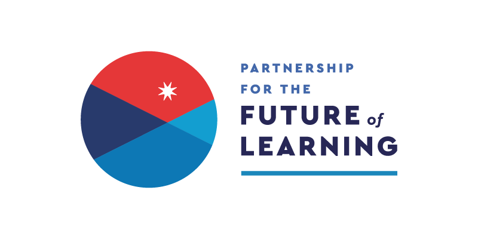
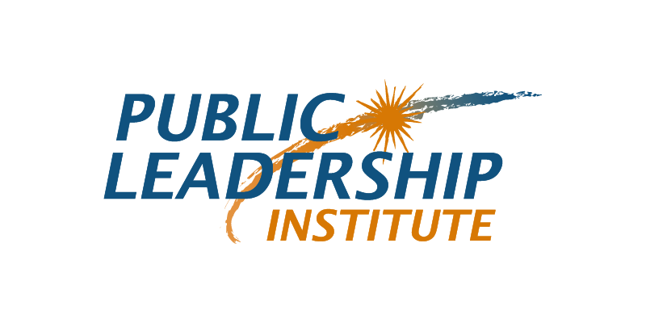
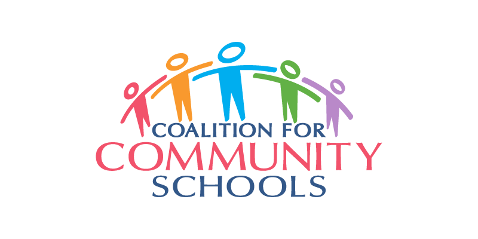
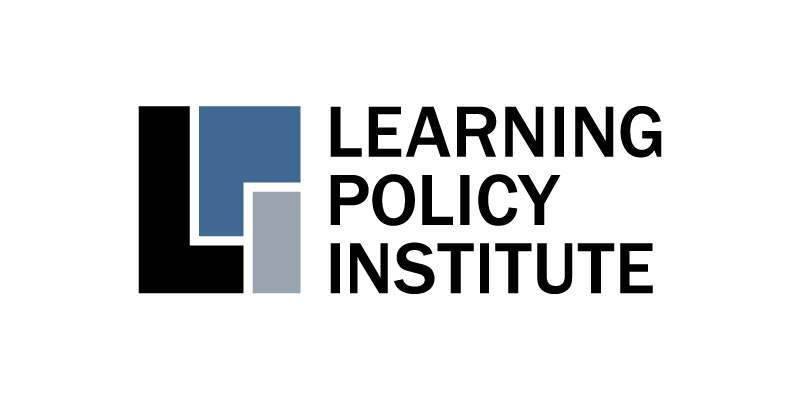
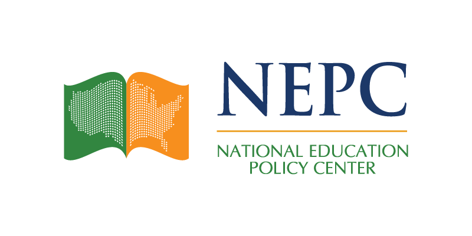
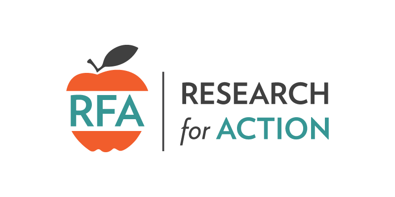

The Community Schools Playbook was produced for the [Partnership for the Future of Learning](https://futureforlearning.org/) by the [Public Leadership Institute](http://publicleadershipinstitute.org/) in partnership with the [Coalition for Community Schools](http://www.communityschools.org/). Research for the Community Schools Playbook was conducted by the [Learning Policy Institute](https://learningpolicyinstitute.org/), the [National Education Policy Center](https://nepc.colorado.edu/), and [Research for Action](https://www.researchforaction.org/).

				

					

					

					

					<!-- Break -->
					

					

					

				

			

We are grateful for the collaboration of the following organizations and individuals who provided review and input on the content and structure of this resource:

#### Organizations

| [Alliance to Reclaim Our Schools](http://www.reclaimourschools.org/) |
| [American Federation of Teachers](https://www.aft.org/) |
| [The Center for Popular Democracy](https://populardemocracy.org/) |
| [City Connects, Boston College](https://www.bc.edu/bc-web/schools/lsoe/sites/cityconnects.html) |
| [Coalition for Community Schools at the Institute for Educational Leadership](http://www.communityschools.org/) |
| [Communities In Schools](https://www.communitiesinschools.org/) |
| [Community Learning Center Institute](http://clcinstitute.org/) |
| [Education Justice Network](https://www.npesf.org/networks/education-justice-network/) |
| [EL Education](https://eleducation.org/) |
| [FrameWorks Institute](https://www.frameworksinstitute.org/) |
| [Journey for Justice Alliance](https://www.j4jalliance.com/) |
| [National Center for Community Schools, Children’s Aid](https://www.childrensaidnyc.org/programs/national-center-community-schools) |
| [National Education Association](http://www.nea.org/) |
| [National Education Policy Center](https://nepc.colorado.edu/) |
| [National Public Education Support Fund](https://www.npesf.org/) |
| [Partners for Each and Every Child, The Opportunity Institute](https://theopportunityinstitute.org/partners-for-each-and-every-child/) |
| [Partnership for Children & Youth](https://www.partnerforchildren.org/) |
| [Public Education Matters Georgia](https://publiceducationmattersga.org/) |
| [UCLA Center for the Transformation of Schools](http://transformschools.ucla.edu/) |
| [Reaching Higher NH](https://reachinghighernh.org/) |
| [Research for Action](https://www.researchforaction.org/) |
| [StriveTogether](https://www.strivetogether.org/) |

#### Individuals

| Jennifer Davis, Education Redesign Lab, Harvard Graduate School of Education |
| Michael DiNapoli, Jr. |
| David Kirp, Goldman School of Public Policy, University of California, Berkeley |
| Milbrey McLaughlin, Stanford University |
| Adeline Ray, Chicago Public Schools |
| Jorge Ruiz de Velasco, John W. Gardner Center for Youth and Their Communities, Stanford University |
