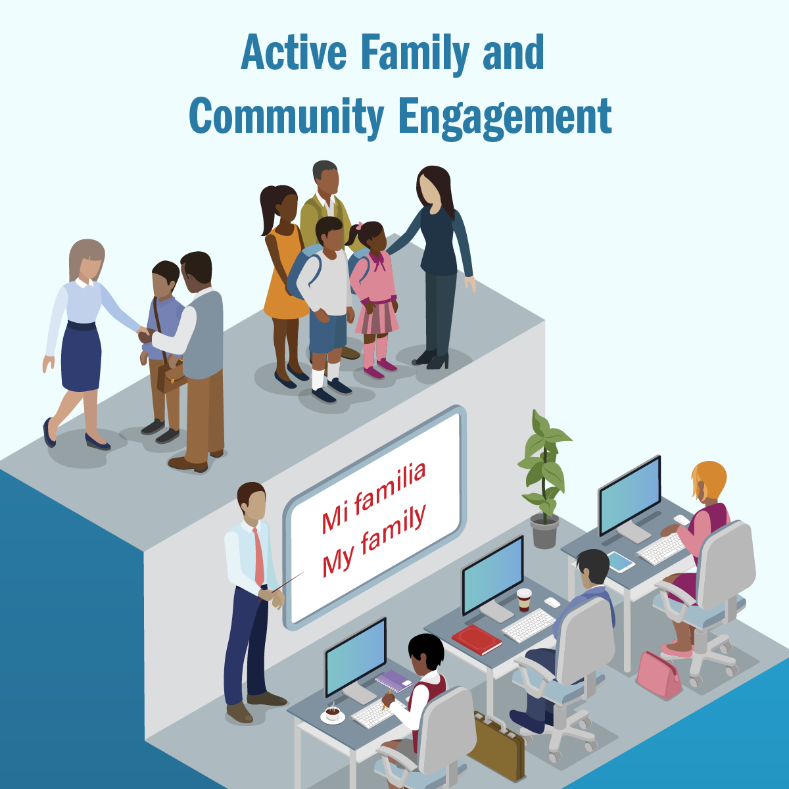

Active family and community engagement—the third pillar of community schools—is essential to fostering relationships of trust and respect, building the capacity of all stakeholders and the school, creating empowered decision-making processes, and leveraging local resources and expertise to address educational inequities. Community schools prioritize meaningful and ongoing engagement of families and community members and establish the systems, structures, and supports to make it happen. Educators and other staff at community schools understand that engagement happens on a continuum—from partnering with parents to develop and promote a vision for student success, to offering courses, activities, and services for parents and community members, to creating structures and opportunities for shared leadership. Families and community members, for their part, feel welcome, supported, and valued as essential partners.

<!-- Active family and community engagement—the third pillar of community schools—is essential to fostering relationships of trust and respect, building the capacity of all stakeholders and the school, creating empowered decision-making processes, and leveraging local resources and expertise to address educational inequities. Community schools prioritize meaningful and ongoing engagement of families and community members and establish the systems, structures, and supports to make it happen. Educators and other staff at community schools understand that engagement happens on a continuum—from partnering with parents to develop and promote a vision for student success, to offering courses, activities, and services for parents and community members, to creating structures and opportunities for shared leadership. Families and community members, for their part, feel welcome, supported, and valued as essential partners-->

## Why Emphasize Active Family and Community Engagement?

Decades of research and experience underscore the importance and positive impact of ongoing and authentic engagement. Meaningful mechanisms for family and community engagement, led by welcoming and culturally informed teachers and school staff, can strengthen the school community, build positive relationships and school climate, and improve student outcomes on many measures, including attendance, discipline, and academic achievement. Families who are supported by the school to understand academic goals and strategies are better able to support student learning—both inside and outside of the classroom. Similarly, schools that are able to engage families and communities in meaningful ways benefit as the staff gain access to new and important funds of knowledge that can support teaching and learning efforts and deepen engagement and community-building efforts. The school system, for its part, gains important advocates, such as for deeper investments, as families and community members understand and support strategic goals and see themselves as vital partners in schools’ success.

Partnering with families and community members on the front end of the community schools implementation process is critical to developing a full understanding of the strengths and challenges of the community and determining the appropriate mix of services, supports, and opportunities. For example, when families and community members participate in the assessment of needs and assets, they provide insight into the root causes of issues facing the community and are also invested in the shared vision created for student and school success.

School-based strategies to engage families and communities in low-income neighborhoods should be informed by historical challenges to meaningful involvement. These challenges include administrators and educators who have often not made schools welcoming places for families from diverse backgrounds or offered programs that support and address diverse cultural backgrounds. In addition, families in low-income areas often deal with other impediments to full participation in school life, such as language barriers, inflexible work schedules, and reliance on public transportation.

Collaboration doesn’t guarantee agreement, but it can help draw out and create dialogue about existing tensions. Through collaboration, stakeholders can build the trust and respect that is needed to make large changes. Community schools can help address these and other challenges by streamlining access to services, making schools safe and welcoming spaces for all families and community members, and scheduling programs, courses, and meetings at times that allow the broadest participation.

In Redwood City, CA, the community schools offer a range of programs and services to support and engage families, including parent leadership coaching, courses to learn English and develop computer skills, volunteer opportunities, and social events for families, such as movie nights. These serve to increase broad-based family participation in schools, which has contributed to improved school and student outcomes. One study, for example, found that the supplemental programs at the district’s community schools reached more than 70% of the families of enrolled students and generally served the most socioeconomically disadvantaged students.[20](#ednnotes)  Students whose families were engaged in these schools were more likely to show gains in English language development and mathematics and were more likely to demonstrate positive attitudes about their school.[21](#ednnotes) These results are consistent with long-term research in Chicago schools that demonstrate the importance of collaborative family and community engagement in schools for increasing trust between stakeholders, as well as improving school climate and attitudes about school.[22](#ednnotes) Improvements in these areas tend to lead to other positive outcomes for students and schools, such as higher attendance and achievement rates and increased reports of students reporting feeling supported.

<a href="http://www.pthvp.org/">Parent Teacher Home Visits (PTHV)</a> is a parent engagement strategy focused on building trusting and respectful family-teacher relationships. Started in Sacramento, CA, the PTHV model is now used in schools in 24 states and is rooted in five core practices: (1) visits are voluntary for both families and teachers; (2) educators receive training and are compensated for their time; (3) visits are conducted with all students—or a cross-section—rather than targeting specific students (such as for behavioral reasons); (4) the first visit focuses on understanding the hopes and dreams of families, rather than on academic outcomes; and (5) educators visit in pairs and reflect with their partners after each visit. Visits using this model can provide a foundational shift in relationships that contribute to better outcomes for students. <a href="http://www.pthvp.org/wp-content/uploads/2016/09/JHU-STUDY_FINAL-REPORT.pdf">In one study</a>, home visits corresponded with a decrease in students’ school absences by 24%. In <a href="http://www.pthvp.org/wp-content/uploads/2016/09/spft-evaluation-2014.pdf">another</a>, students and their families reported an increase in how much they trust their educators, which led to improved communication beyond the initial visit. Teachers involved in home visits reported a <a href="http://www.pthvp.org/wp-content/uploads/2018/02/PTHV_Study1_Report.pdf">mindset</a> shift in how they regard students’, families’, and communities’ assets as well as an increase in teachers’ perceptions of job satisfaction and efficacy. 
 

The recent national focus on increasing family and community engagement, such as the engagement requirements of the Every Student Succeeds Act (ESSA) and the Department of Education’s promotion of the [Dual Capacity-Building Framework for Family-School Partnerships](https://www2.ed.gov/documents/family-community/partners-education.pdf), is encouraging. However, building the capacity of educators and school staff is a prerequisite for designing and implementing effective engagement strategies. So, too, is building relationships of trust and respect between home and school, particularly in schools in culturally diverse or low-income neighborhoods.[23](#ednnotes) In more affluent communities, family and community members often have the social capital and understanding of how school systems work and engage in a range of activities that help to support school improvement and student learning. Because families in more affluent communities experience few, if any, of the impediments to participation mentioned—and often have more of a built-in safety net and basic support structure—they can more easily engage with their children’s educational experiences.

Policies that support schools, families, and communities to work together can help close achievement and opportunity gaps. To move beyond a history in many low-income communities in which family and community input was not valued or incorporated, engagement processes must send the clear message that stakeholders’ participation and contributions are valued and reinforce this message with sufficient resourcing and staffing.

## The Need is Great and Public Support is Strong

A [2015 national survey](http://news.gallup.com/businessjournal/186026/crucial-element-successful-schools-parent-engagement.aspx) by Gallup underscores the need for deeper investments in family and community engagement and highlights particular practices that can enable parents to play an active role in the school. The study found that only 23% of parents strongly agreed that they participated in classroom and school activities, and just 41% strongly agreed that their child’s school provided a variety of ways for parents to become involved. Only 20% of parents in the study were fully engaged with their child’s school, as Gallup measured engagement; 23% of parents were “actively disengaged” with the school their child attended.

But lack of engagement doesn’t mean lack of interest. In fact, when schools employ a variety of “drivers” to support parent engagement, more parents get involved, according to another
[2015 Gallup survey](http://news.gallup.com/businessjournal/186245/critical-drivers-parent-engagement-schools.aspx). Specifically, the survey identified five key drivers that support parent engagement: (1) leadership that creates a respectful, open, and trusting environment; (2) opportunities for each student to achieve success in ways that fits how he/she learns best; (3) an atmosphere in which students are treated with respect and receive appropriate discipline; (4) a personalized learning environment where teachers and staff know each child’s individual strengths and needs; and (5) meaningful and open communication between parents and teachers. When surveyed, parents were very satisfied with at least one of these five drivers; 58% were fully engaged. When parents were satisfied with all of the five drivers, 84% were fully engaged and none were actively disengaged.

## Policy Principles

Family and community engagement should be a key element of every community school policy. Many states and localities have implemented a variety of policies and funding streams that support family and community engagement. The discussion and principles that follow draw from the best policies on family and community engagement—whether they are stand-alone or part of a comprehensive community schools approach.

The effectiveness of family and community engagement programs depends on the quality of the policy design and implementation. The principles that follow build upon existing resources and the research-based principles discussed in the Learning Policy Institute and National Education Policy Center report, [Community Schools as an Effective School Improvement Strategy: A Review of the Evidence](https://learningpolicyinstitute.org/product/community-schools-effective-school-improvement-report). To advance authentic engagement, policies should be designed to ensure the following:

1.	Structures and practices in schools support a continuum of family and community engagement practices, such as help for parents in supporting the needs of students, classes for families and community members, volunteer opportunities, inclusion on school leadership teams, and leadership coaching to support their full participation.

2.	Teachers and school staff have opportunities to value and learn from the experiences of parents and communities, seeing them as having “funds of knowledge” that can inform classroom practices and curriculum, making them more relevant to students’ cultural backgrounds and experiences. This, in turn, fosters stronger relationships with parents and families.

3.	School staff and leaders have opportunities to develop their capacity to build trusting, collaborative relationships with families and community members, recognize class and cultural backgrounds as having important assets for the school, and share power and responsibility.

4.	Families and community members are engaged at all steps of the assessment, planning, implementation, and evaluation of the community schools strategy.

5.	District leadership and facilitation support schools as they implement programs and reach out to families and community members.

6.	Trusted partner organizations participate in building strong relationships that are key to the strategy and important for its effective implementation.

### Policy Types & Examples

States and localities have used different policy mechanisms to support family and community engagement. Below are examples of different types of policies that incorporate key family and community engagement principles, both on their own and as part of a comprehensive community schools strategy.

#### State Policies

Several state governance bodies have enacted measures that provide a solid foundation for family and community engagement programs and practices. These include policies that promote and require engagement, authorize and define family and community engagement, provide incentive grant programs, offer an increased formula funding, and support professional development and technical assistance.

Additionally, the Every Student Succeeds Act (ESSA) includes several family engagement requirements. States were required to have meaningful consultations with parents before submitting their ESSA plans, including opportunities for public comment. Districts, for their part, must also consult with parents on the plans they submit to the state. In addition, districts must reserve at least 1% of their Title I funding for [family engagement activities](http://civilrightsdocs.info/pdf/education/ESSA-Parent-Family-Engagement.pdf), such as outreach and capacity-building at the school level. Ninety percent of these funds must go to school sites, prioritizing high-needs schools.

#### State policies, ordinances, and resolutions

*	**California’s** [Local Control Funding Formula (LCFF)](https://www.cde.ca.gov/fg/aa/lc/lcffoverview.asp), which was signed into law in July 2013, includes parent engagement as one of eight state priority areas and requires parent, student, and stakeholder engagement in developing district plans and budgets. [Research studies](https://caljustice.egnyte.com/dl/iPMAKIECjC) on implementation of these new requirements show that districts employing a wide variety of techniques to engage students and families were more effective in their outreach, as were those that partnered with community-based organizations to increase the turnout and diversity of parents and students. A [February 2018](http://edpolicyinca.org/sites/default/files/LCFF_RC_engagement cases.pdf) study on implementation of LCFF identified meaningful stakeholder engagement as key to the effectiveness of improvement strategies in each of the three districts profiled. The [California Collaborative for Educational Excellence](http://ccee-ca.org/) has partnered with parent and student organizations to offer learning communities to build the capacity of districts to meaningfully engage a broad cross-section of students, parents, and community members. Among the characteristics of meaningful district-level engagement were: leadership opportunities for historically marginalized communities; transparent decision-making processes; sustained engagement throughout the planning and implementation stages; collaboration with outside partners to bring in more resources and perspectives to amplify the voices of previously marginalized people.[24](#ednnotes)

*	An innovative approach to family and community engagement can be seen in **Colorado** legislation that adopted the PTA National Standards as the state family engagement framework. The legislation assists educators and families by coordinating early literacy strategies as well as career and academic plans. In 2009, the General Assembly also created a state advisory council for parent involvement in education that will review best practices and recommend to policymakers and educators strategies to increase parent involvement in public education.[25](#ednnotes) This council, according to state law, includes parents and statewide organization representatives and advises on best practices.

*	In **Washington State**, the Educational Opportunity Gap Oversight and Accountability Committee, created during the 2009 legislature to address the state’s achievement gap, embedded parent, student, and community engagement into its design. The committee was charged by [RCW 28A.300.136](http://app.leg.wa.gov/rcw/default.aspx?cite=28A.300.136) with synthesizing the findings and recommendations from five achievement gap studies into an implementation plan and then recommending policies and strategies. The state legislature implemented the 2015 recommendations in 2016 in the [Fourth Substitute House Bill 1541](http://lawfilesext.leg.wa.gov/biennium/2015-16/Pdf/Bills/Session Laws/House/1541-S4.SL.pdf?cite=2016%20c%2072%20%C2%A7%20804;). The [2017 annual report](http://www.k12.wa.us/WorkGroups/EOGOAC/pubdocs/EOGOAC2017AnnualReport.pdf) of the committee further supported family and community engagement and outreach. Its recommendations to the legislature included: allocating additional funds to support a multiyear statewide family engagement workgroup and adopting the Office of Education Ombud’s [four recommendations](http://oeo.wa.gov/wp-content/uploads/1408ReportRevisedFinal.2017.03.10.pdf) on family and community engagement. The committee also directed school districts to reach out to families and communities when creating and implementing cultural competency training programs.

#### Board of education resolutions
State boards of education may issue a policy or resolution in support of collaboration in community schools. While these resolutions tend to be shorter and less detailed than legislative bills, they can help in expressing state support for family and community engagement and lay the groundwork for the development of more specific policy documents to follow at the state or local level. This approach does not, however, provide direct funding for family and community engagement or other elements of community schools, which tends to be the most powerful policy lever to support meaningful change.

*	The **West Virginia** [State Community Schools Policy](http://apps.sos.wv.gov/adlaw/csr/readfile.aspx?DocId=25989&Format=PDF), adopted in 2014, defines and provides guidance for implementing and maintaining sustainable community schools. Borrowing language from national experts at the [Coalition for Community Schools](http://www.communityschools.org/), the document specifies that community schools should strive to have both community and family engagement. It elevates the critical nature of family and community engagement and notes that community schools “consistently and sustainably increase parent participation in the education of their children and in their schools by empowering families.” The policy further describes community schools as hubs and cultural centers of many neighborhoods and importantly describes engagement as the key factor that differentiates community schools from simply providing wraparound services.

#### Local Policies

At the local level, the following policies were selected as exemplars because they include a comprehensive definition of family and community engagement, demonstrate a range of possible ways of implementing this strategy, clearly define next steps for different individuals or groups responsible for implementing family and community engagement programs and strategies, and lay out clear parameters regarding effective collaboration among stakeholder groups.

#### School board resolutions for family and community engagement

*	In October 2016, the **Baltimore City Board of School Commissioners** created the [Community School Strategy](https://www.boarddocs.com/mabe/bcpss/Board.nsf/files/AEXQ2G672538/$file/ADH- Community School Strategy.2nd Reader CLEAN.pdf), which states, “The Board supports a Community School Strategy continuum that creates school environments that are welcoming and led by an integrated belief system that transmits to students and families pride, opportunity, and high expectations through the collective efforts of youth, parents, businesses, faith communities, and community organizations.” As part of this strategy, at the end of the year, schools must report on a [number of outcomes](https://www.boarddocs.com/mabe/bcpss/Board.nsf/goto?open&id=AHBLMJ52F061), including community engagement/partnerships, using such indicators as service learning opportunities and hours and the number and quality of partnerships. The strategy says that the board and city school staff will engage families and community members in supporting the community schools’ operation and expresses an intention to expand the strategy statewide.

*	**Cincinnati** has extensive experience (as explained in Chapter 2) in engaging youth, families, and community members through its [Community Learning Centers](http://www.communityschools.org/assets/1/AssetManager/CincinnatiBoardPolicy.pdf). The Board of Education passed a Community Learning Center (CLC) policy in 2009, converting schools into CLCs and providing them with a resource coordinator to supervise the needs assessments and manage service agreements with community partners. Today, 46 of 63 of the schools are CLCs. As part of a community involvement policy adopted in 1981, Cincinnati also established [Local School Decision Making Committees (Board Policy 9142)](https://www.dropbox.com/s/ua0kn9jslvjb1ke/LSDMC Board policy.pdf?dl=0) that include parents and community members and have broad responsibilities and authorities, including budgeting, hiring, and partner selection. These policies, which have continued over decades, demonstrate a deep commitment to maintaining meaningful family and community engagement within a community schools-oriented district.

*	In May 2017, the Los Angeles Unified School District passed a [board resolution](https://boe.lausd.net/sites/default/files/05-09-17RegBdCSOBD.pdf) endorsing community schools as a research-backed strategy for school improvement and community development. The resolution defines authentic family and community engagement: “The full community actively participates in planning and decision-making at each school site. This process recognizes the link between the success of the school and the development of the community as a whole.” It lays the foundation for engagement and partnership by establishing a Community School Implementation Team that includes a broad cross-section of members, including community and business partners, community-based organizations, and representatives of the teachers’ union and district staff.

#### District strategic plans

* The **Austin Independent School District (AISD)**, as part of the [AISD Strategic Plan](https://www.austinisd.org/sites/default/files/dept/strategic_plan/docs/REVISED_PLAN_Dec_2017.pdf), has a [Parent Engagement Support Office](https://www.austinisd.org/parentsupport) that works to create collaborative school cultures that engage parents, families, students, teachers, staff, and community members. The district’s strategic goals include building capacity for parent leadership, identifying resources to support parents and families, conducting outreach to parents, offering education programs for parents, and offering professional development to deepen the capacity of AISD staff to work with parents. In addition, the city of Austin pays for a [parent support specialist](https://www.austinisd.org/parentsupport/parentsupportspecialists) in 74 schools that are designated low-income. This person is responsible for engaging families through such strategies as organizing and conducting parent training sessions; holding parent meetings to share information and gather input; and providing resources and referrals for supports, as needed. Parent support specialists are also responsible for conducting outreach and creating parent leadership opportunities.

*	**Cleveland, OH’s** [Family Engagement Plan](https://www.clevelandschools.org/cms/lib/TN01917036/Centricity/Domain/308/CCS Family Engagement Plan 2017 2018.pdf) offers a strong framework for creating effective family engagement programs that support the district’s implementation of community schools. The [work](http://www.clevelandmetroschools.org/Page/620) is focused on expanding the capacity of schools to partner with families and community-based organizations to support student achievement and school improvement. For example, the district provides guidance for school teams to develop family engagement plans, which are reviewed by the Board of Education annually, according to their Parental and Family Involvement Policy (4.502). The district also includes parents in planning districtwide goals, and each school is required to have parents on the School Improvement Planning team. Schools provide parents with training and materials to help them support students and engage as equal partners in the schools. The district also aims to build the capacity of teachers, principals, and parent coordinators to reach out and communicate with families as partners and build meaningful ties between home and school.

*	**[The Oakland Unified School District](https://www.ousd.org/CommunitySchools)** began implementing a community schools initiative in 2010 as an integral part of its school improvement strategy. Key to the strategy has been the increased efforts to create meaningful family and community engagement opportunities, and the creation of a district Family Resource Center. As it began the community schools initiative, the district also created a task force comprised of 25 to 30 members from the school district and the community, including representatives from the East Bay Asian Youth Center, and the Oakland Unity Council, among others. This group met weekly for over 7 months to plan and also held community meetings to gather input about the community schools.  
The community schools are supported by a robust and integrated program at the district level for family and community engagement. The [Office of Family Engagement](http://www.ousdfamilytoolkit.org/about-ousd-fe/) uses a dual-capacity framework to assist families and schools in creating structures to support shared decision-making and leadership. To encourage such efforts, they offer [services and programs](http://www.ousdfamilytoolkit.org/programs/), such as technical assistance with the formation and democratic election of School Governance Teams that include families and students; Academic Parent Teacher Teams through which teachers and families strategize on how to improve student learning; and parent leadership development and opportunities for deep engagement. The district [Family Resource Center](https://www.ousd.org/Page/10632) provides families with health insurance enrollment assistance, various workshops, and capacity-building resources for school sites. With [high standards](http://www.ousdfamilytoolkit.org/) for what Oakland schools consider meaningful family engagement, the district offers many [resources](http://www.ousdfamilytoolkit.org/coordination-planning/) for coordinating and planning engagement efforts; [tools](http://www.ousdfamilytoolkit.org/race-power-family-engagement/) for understanding and addressing inequities as a result of race, class, gender, and immigration status; and [resources](http://www.ousdfamilytoolkit.org/measuring-family-engagement/) to help assess the impact of engagement plans.  
Oakland Unified School District has also advanced a [strong engagement model](http://lcapwatch.org/wp-content/uploads/2017/05/Oakland_Unified_LCAP_Summary_2016_19_rez.pdf) to develop its Local Control Accountability Plan, which details program and spending priorities and is required under the state’s Local Control Funding Formula. For example, it has established a unique process for electing students, parents, and community members to ensure representation from across the racially and socioeconomically diverse district.

#### School board and union contracts

*	In **St. Paul, MN**, where there is a statewide community schools program, the president and members of the teachers’ union identified the need to engage families and build more trusting relationships. They began conducting home visits using the [Parent Teacher Home Visit](http://www.pthvp.org/) model, designed to build trust and foster learning and sharing through authentic conversations between teachers and parents. Prior to home visits, participating teachers receive training by a parent-teacher team. The union successfully bargained to include home visits in its contract and conducted [1,600 home visits](https://learningpolicyinstitute.org/blog/community-schools-building-home-school-partnerships-support-student-success) in the 2016–17 school year. Following a round of home visits, the teachers debrief together and find ways to integrate parents’ concerns into the contracts they negotiate with the district. A recent study by [RTI International](http://www.pthvp.org/wp-content/uploads/2018/02/PTHV_Study1_Executive-Summary-1.pdf) found that these kinds of home visits can be an effective strategy for increasing empathy and reducing negative biases from teachers toward parents, while also helping parents feel more confident about interacting with school officials.

#### City council/local government policies
City councils and city/county government agencies can also play a role in supporting family and community engagement in community schools. Related resolutions are often focused on intergovernmental collaboration, with an emphasis on partnering with the local school district as the entity directly responsible for overseeing community schools.

*	In San Pablo, CA, the City Council’s [resolution authorizing support for full-service community schools](http://cscinnovation.org/wp-content/uploads/2012/09/San-Pablo-Resolution-Full-Service-Community-Schools.pdf) (outlined in [Chapter 2](chapter-2)) describes community schools as places where stakeholders work to address the needs of students, families, and the community. The [City of San Pablo Community School Initiative](http://sanpabloca.gov/DocumentCenter/Home/View/1525) describes full-service community schools in this way: “School district, city, county, community and faith-based organizations, businesses, families, and philanthropists form a strong, deep and transparent partnership to jointly address the identified needs of students, families, and community in a comprehensive, integrated, and accountable way. They share leadership, work towards a common vision and agenda, and share responsibility for results.” The centrality of such rich engagement in community schools demonstrates the collaborative nature of the initiative at the school and district levels.

#### Mayoral leadership and resources
Mayoral support can also help to drive the local implementation of community schools and family and community engagement as an integral part of these efforts, as discussed in Chapter 2. Mayors can exert influence through budgetary proposals and by directing city government or local school district resources to support community schools (as in New York City).

*	**[New York City’s Community School Strategic Plan](http://www1.nyc.gov/assets/communityschools/downloads/pdf/community-schools-strategic-plan.pdf)** lays out the roadmap for the city to build and sustain its community schools (which total 227 in 2018). The guide provides a model framework, as it encompasses all four pillars of the community school model and lays out a funding strategy and a plan for system-building efforts. The plan supports strong family and community engagement, identifying parents and caregivers as “real and active partners” in their children’s education and in building a stronger school community. Within the community schools initiative, the family and community engagement plan includes establishing a positive, culturally relevant school climate; fostering collaborative decision-making with broad participation from stakeholders; employing a strategy of family and community engagement with multiple possibilities and opportunities for participation; making the school a hub for families and community; and fully integrating the broader community and culture into the school through activities such as community tours and service provider fairs to share information on available resources. Finally, it encourages family and community engagement through the School Leadership Team (discussed in more detail in Chapter 6), which is a governing body at the school level that includes family and community members, as well as students.

In New York City, parent and community organizations played a pivotal role in making education a key campaign issue in the 2013 mayoral election. The efforts of these organized parents and community members led to firm mayoral commitment to a citywide community school initiative. Because of their organizing and advocacy, these groups were positioned to support and challenge the district to implement the strategy effectively. The groups came together under the banner of the Coalition for Community School Excellence, which is comprised of over 40 Community-Based Organizations (CBOs), advocacy groups, and education organizations. The Coalition’s stated priorities include ensuring that schools are using research-based instructional strategies that are coordinated with student supports; securing and communicating clear benchmarks for progress; ensuring that there are structures to support the schools; and building public support to sustain and expand the model by training and organizing parents and engaging elected officials. Working with the district’s Office of Community Schools, the Coalition members support system-level responses to ideas and challenges that CBO staff experience in schools. This has led to improved relationships between principals and community school directors, more targeted supports for schools, and processes to improve implementation.

#### District family and community-level engagement plans

*	In **Albuquerque, NM**, the public schools have a [robust policy](http://www.aps.edu/about-us/policies-and-procedural-directives/policies/k.-school-community-home-relations/kb-family-and-community-engagement) that affirms that family and community engagement is critical to student success. It creates processes for collaborative decision making, includes capacity building to ensure meaningful engagement, and provides integrated supports for students and families. The [Family Engagement Collaborative](http://www.aps.edu/family-engagement-collaborative) brings the New Mexico PTA together with a number of district departments, including Coordinated School Health; Counseling; Nursing; Curriculum and Instruction; Equity and Engagement; Student, Schools and Community Service Center; Family Engagement/Parent University Unit; and more. Charged with strengthening relationships and capacities with families, schools, communities, and district administration, using data for improvement, and expanding communication between entities, the Collaborative seeks to integrate school and district-level family engagement plans. These efforts, in conjunction with the [Parent University Leadership](http://www.aps.edu/coordinated-school-health/family-and-community-engagement-programs), which builds the capacity of families to support student learning and expand family engagement efforts at their school, support continuously improved engagement plans. Schools can improve their engagement plans through the [School Training for Engagement Planning (STEP)](http://www.aps.edu/coordinated-school-health/family-and-community-engagement-programs/family-engagement-unit) workshops for school staff and administrators. In the STEP program, participants learn about best practices for family engagement, are supported in developing a comprehensive research and data-based plan and receive follow-up coaching and technical assistance to support implementation. The district also provides [tools and resources](http://www.aps.edu/family-engagement-collaborative/tools-for-schools) for schools to use to assess their current practices and make goals for improved practice.

*	In **Hartford, CT**, district leaders, together with community organizations and the Hartford Foundation for Public Giving, engaged more than 200 stakeholders to create a [Family and Community Engagement Plan](https://www.hartfordschools.org/files/Family%20Engagement/HPS_FCE_Plan_10_20_15.pdf) that includes implementing the community school model. In addition to the extensive consultation with community members and organizations, the plan relies on research, including Karen Mapp’s Dual Capacity-Building Framework.[26](#ednnotes) It advances educational equity by: (1) embedding family and community engagement into the core processes and day-to-day work of the district and schools; (2) identifying and promoting practices that connect families and partners to learning outcomes and goals of students; (3) fostering capacity- and trust-building and engagement of all stakeholders; and (4) advancing the shared commitment and investment of the entire community. While this is currently a local plan, supporters are working to expand it to the state level.

## Implementation  

High-quality implementation is a crucial determinant of positive program outcomes. High-quality programs do not happen by chance. They result from policy choices, resource allocations, and technical assistance that support both staff capacity and student participation. They also depend on active family and community engagement.

### Characteristics of high-quality implementation

High-quality implementation is a crucial determinant of positive program outcomes. Family and community engagement efforts can be undermined by uncoordinated programs and competing priorities at both the school and district level. Improving the integration and coherence of such programs throughout the school and district, including providing needed professional development for teachers and school staff, can improve implementation. When done well, family and community engagement results in shifts in culture, beliefs, and practices.

*	Staff and families have a greater sense of comfort and self-efficacy as they engage in partnership activities and work across different cultures.
*	Staff are committed to working as partners with families and believe in the value of such partnerships for improving student learning.
*	Families view themselves as partners in their children’s education and support their children’s learning.

The following characteristics of high-quality implementation draw from the U.S. Department of Education’s [Dual Capacity Building Framework for Family-School Partnerships](https://www2.ed.gov/documents/family-community/partners-education.pdf), which recommends practices that support the capacity of both families and school members to engage in partnership, rather than focusing exclusively on families.

1.	School and district staff incorporate local knowledge from the communities they serve into community school practices and curriculum. These staff members must also be trained in and demonstrate cultural competency, so they can build trusting relationships with families and community members.

2.	Families have easy access to information about student learning and how the school system works.

3.	There are regular, consistent, and bidirectional channels of communication between families and school staff to make sure families know how their children are doing and are aware of school programs, events, and opportunities.

4.	Parents have access to capacity-building opportunities to engage in advocacy and provide educational support for their children.

5.	Staff and families have strong, cross-cultural networks built on trust and respect that increase their capacity to support students’ development. These networks include family—teacher relationships, parent-parent relationships, and connections with community agencies and services.

6.	Efforts to expand learning opportunities draw on the knowledge and opportunities of families and communities to develop rich opportunities for hands-on learning in schools and neighborhoods.

7.	Schools include families and community members in decision making, planning, asset and needs assessments, evaluations, and implementations.

8.	Integrated student supports are planned and executed with families and community members to ensure they meet needs and create regular opportunities for engagement.

9.	Partner organizations that are trusted within the community are incorporated into the school by a full-time community school director.

___
### Endnotes

| [20](chapter-5#why-emphasize-active-family-and-community-engagement) | Castrechini, S., & London, R. A. (2012). _Positive student outcomes in community schools_. Washington, DC: Center for American Progress. |
| [21](chapter-5#why-emphasize-active-family-and-community-engagement) | Castrechini, S., & London, R. A. (2012); Biag, M., & Castrechini, S. (2016). Coordinated strategies to help the whole child: Examining the contributions of full-service community schools. _Journal of Education for Students Placed at Risk_, 21(3), 157–173 |
| [22](chapter-5#why-emphasize-active-family-and-community-engagement) | Bryk, A. S., Sebring, P. B., Allensworth, E., Easton, J. Q., &   Luppescu, S. (2010). Organizing Schools for Improvement: Lessons from   Chicago. Chicago, IL: University of Chicago Press. |
| [23](chapter-5#why-emphasize-active-family-and-community-engagement) | Mapp, Karen L and Kuttner, P. (2014). Partners in Education: A Dual   Capacity-Building Framework for Family – School Partnerships. |
| [24](chapter-5#state-policies-ordinances-and-resolutions) | Partners for Each and Every Child. _Process and protest, California: How are districts engaging stakeholders in LCAP development?_ [http://partnersforeachandeverychild.org/process-and-protest-california/](http://partnersforeachandeverychild.org/process-and-protest-california/). |
| [25](chapter-5#state-policies-ordinances-and-resolutions) | C.R.S. § 22-7-301(2), 2012 |
| [26](chapter-5#district-family-and-community-level-engagement-plans) | Mapp, Karen L and Kuttner, P. (2014). |

[See all Endnotes](endnotes)
