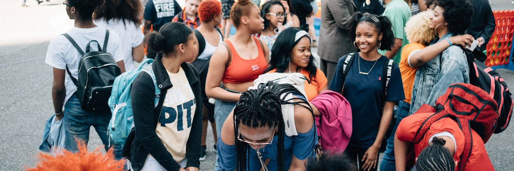
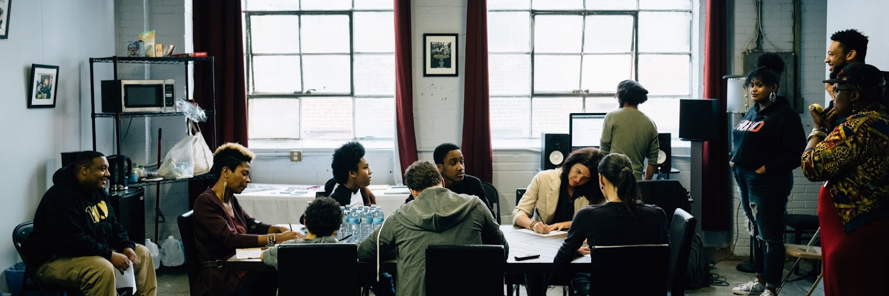
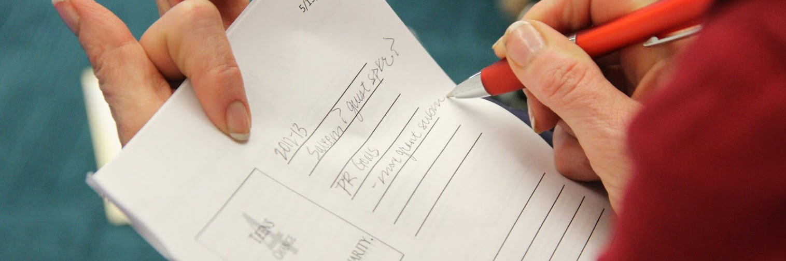
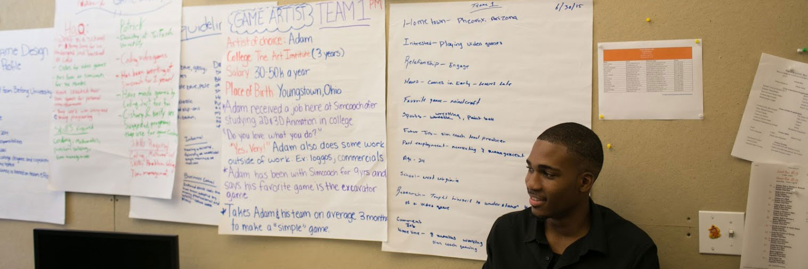

<section>

<!-- Section One -->

<header class="major">
	<h2 id="section-one">Section One: The Fundamentals of Community Schools</h2>
</header>

	<two-up>
		
		<h3>An Introduction to Community Schools</h3>
		
Learn about the definition of Community Schools, why they work, and what it takes to implement them.

		<ul class="actions">
			<li><a href="chapter-1" class="button fit small">Read the introduction</a></li>
		</ul>
	</two-up>
	<two-up>
		
		<h3>Policies that Advance Community Schools</h3>
		
Understand the policy mechanisms and principles that underpin Community Schools and see how they are being implemented in states.

		<ul class="actions">
			<li><a href="chapter-2" class="button fit small">Learn about the policies</a></li>
		</ul>
	</two-up>
	

<!-- Section Two -->

	<header class="major">
		<h2 id="section-two">Section Two: Four Pillars of Community Schools</h2>
		</header>
	

		<article>
			
			

				<h3>Integrated Student Supports</h3>
				
A dedicated staff member coordinates support programs to address out-of-school learning barriers for students and families. Mental and physical health services support student success.

				<a href="chapter-3" class="button fit small">Learn about the first pillar</a>
			

		</article>
		<article>
			
			

			<h3>Expanded and Enriched Learning Time and Opportunities</h3>
			
Enrichment activities emphasize real-world learning and community problem solving. After-school, weekend, and summer programs provide academic instruction and individualized support.

			<a href="chapter-4" class="button fit small">Learn about the second pillar</a>
			

		</article>
		<article>
			
			

				<h3>Active Family and Community Engagement</h3>
				
Schools function as neighborhood hubs. There are educational opportunities for adults, and family members can share their stories and serve as equal partners in promoting student success.

				<a href="chapter-5" class="button fit small">Learn about the third pillar</a>
			

		</article>
		<article>
			
			

				<h3>Collaborative Leadership and Practices</h3>
				
Parents, students, teachers, principals, and community partners build a culture of professional learning, collective trust, and shared responsibility through site-based leadership teams and teacher learning communities.

				<a href="chapter-6" class="button fit small">Learn about the fourth pillar</a>
			

		</article>
	

	

	

<!-- Section Three -->

	<header class="major">
		<h2 id="section-three">Section Three: Resources You Can Use</h2>
	</header>
	

			<two-up>
			
			<h3>Messaging</h3>
			
Use this practical guidance, opinion research, and message points to be an effective communicator for community schools.

			<ul class="actions">
				<li><a href="chapter-7#talking-points" class="button fit small">Talking Points</a></li>
				<li><a href="chapter-7#useful-facts-and-statistics" class="button fit small">Facts & Statistics</a></li>
				</ul>
			<ul class="actions">
				<li><a href="chapter-7#answering-tough-questions" class="button fit small">Answering Tough Questions</a></li>
			</ul>
		</two-up>
		<two-up>
			
			<h3>Model Legislation</h3>
			
Use these sample bills and resolutions to enact community schools policies at state, city, county, and school board levels.

			<ul class="actions">
				<li><a href="model-leg_state" class="button fit small">State Bill</a></li>
				<li><a href="model-leg_school" class="button fit small">School Board</a></li>
				</ul>
			<ul class="actions">
				<li><a href="model-leg_local" class="button fit small">City or County Resolution</a></li>
			</ul>
		</two-up>
		

		

		

			<two-up>
				
				<h3>Community Schools in ESSA State Plans</h3>
				
From Maryland to New Mexico, Ohio to Hawaii, see how states are activating community schools through ESSA.

				<ul class="actions">
					<li><a href="chapter-9" class="button fit small">Explore the state plans</a></li>
				</ul>
			</two-up>
			<two-up>
				
				<h3>Implementation Resources</h3>
				
A collection of guides, standards, strategies, and other tools for implementing Community Schools.

				<ul class="actions">
					<li><a href="chapter-10" class="button fit small">Browse the resources</a></li>
				</ul>
			</two-up>
			

<!-- Appendix -->

	<header class="major">
				<h2 id="media">Media</h2>
			</header>
			

				<article>
			
			<h3>Videos </h3>
			
Use these videos, graphics, and memes to share the story of Community Schools with your network.

			<ul class="actions">
				<li><a href="videos-media#videos" class="button fit small">Watch the Videos</a></li>
			</ul>
		</article>
					<article>
				
				<h3>Infographics</h3>
				
Use these videos, graphics, and memes to share the story of Community Schools with your network.

				<ul class="actions">
					<li><a href="videos-media#infographics" class="button fit small">Download the Infographics</a></li>
				</ul>
			</article>
		

</section>
